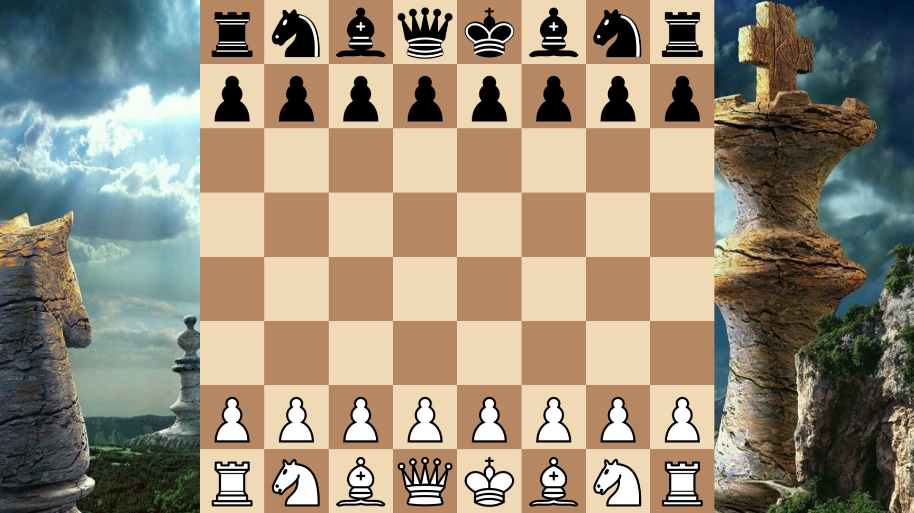
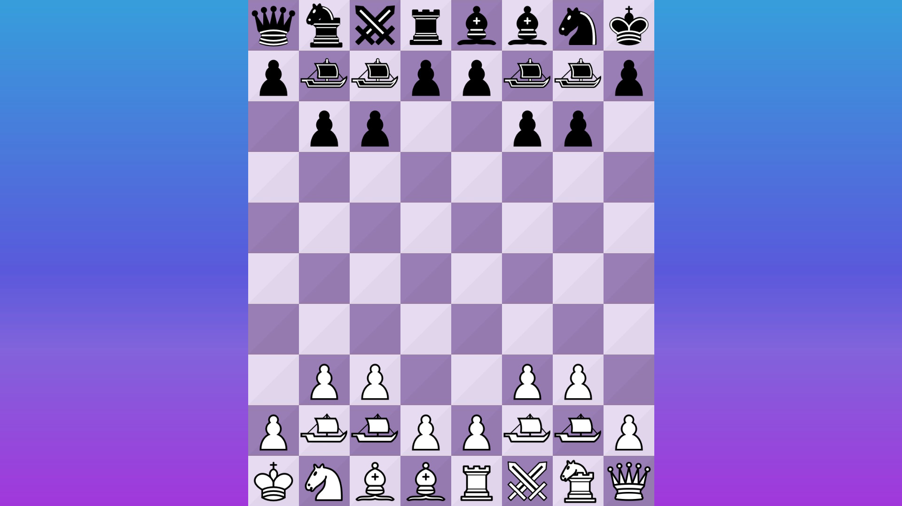
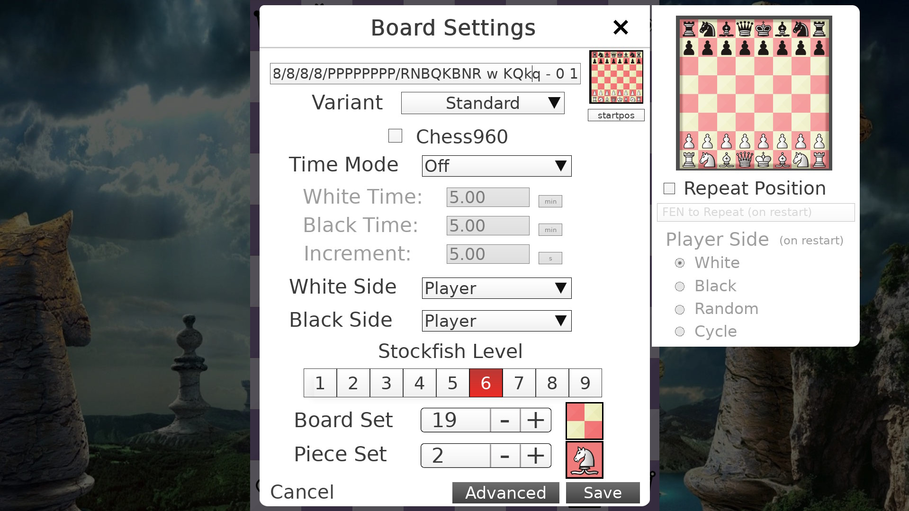
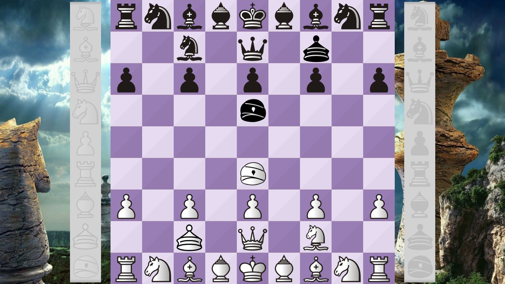
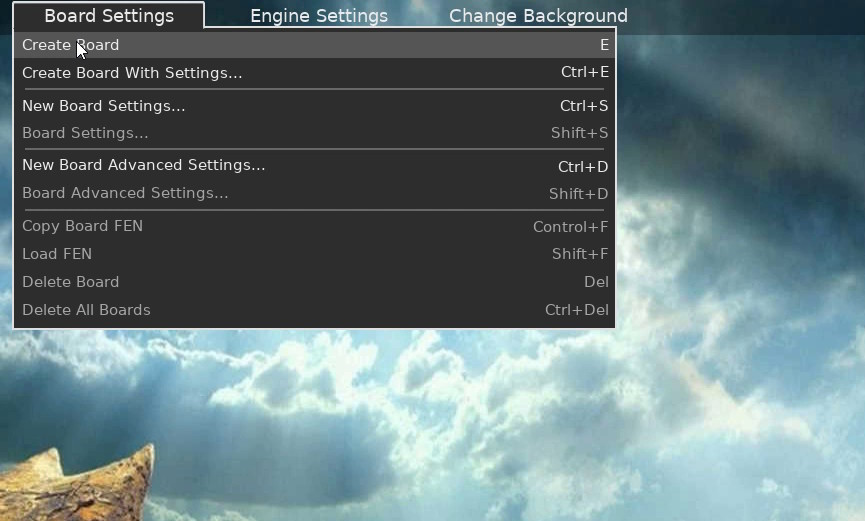

# SF-Chess
SF-Chess is a Windows Chess Graphical User Interface made with SFML and is written in C++, it is designed to support a multitude of chess variants and custom rules. It supports playing with an engine ([Fairy-Stockfish](https://fairy-stockfish.github.io/)), playing solo, adding custom variants (with limitations) and a lot of customizability.

It was a project made for fun and it is my first serious solo project that I've finished which took over a year to code and add variant support (March 2025 - July 2026)

It uses all of the following libraries and applications for its functionality: [SFML 3.1.0](https://www.sfml-dev.org/download/sfml/3.1.0/), [TGUI 1.13](https://tgui.eu/download/), [Boost 1.86.0](https://www.boost.org/releases/1.86.0/), [Fairy-Stockfish](https://fairy-stockfish.github.io/) and [clip](https://github.com/dacap/clip).

   

## Installing & Configuring
To install, go to the [Releases Tab](https://github.com/demoman2/SF-Chess/releases) and get the .zip file for the latest version, unzip the file and open the .exe file, the app should start up and you can begin playing. 

If you want to configure the variant structure, or modify the variants themselves, you can edit the variantsettings.txt file or the variants.ini file respectively, they are both located in assets/other.

## Using The App
Upon starting the app, you should be able to see the buttons "Board Settings" and "Engine Settings" at the top of the screen, they will both let you customize their respective functionalities to your liking.

To begin playing, click the "Board Settings" button and click the "Create Board" button, or press E on your keyboard. This will make the board that you will play on. 
The buttons "New Board Settings...", "New Engine Settings..." etc will set the settings for any new board you make.

To close the app, press the escape key on your keyboard.

Do not touch the Engine Settings "CPU Threads" and "Hash Size" if you do not know what they do, they can significantly increase CPU and Memory Usage.

The app contains many board keybinds, here is a full list of them:

Click to expand

- Ctrl + T: Enables or disables time control on games.
- N: Resets the current position and creates a new one.
- A: Enables or disables the engine (Fairy-Stockfish) from playing.
- L: If the engine is enabled, it will play against itself.
- P: Sets the next piece set on the current board, if available.
- B: Sets the next board image on the current board.
- V: Sets the variant to the next one in the variant list.
- F: Sets the variant to the previous one in the variant list.
- H: Sets a random variant from the current variant list.
- C: Enables or disables Chess960 style positions on the current board. Note that only a limited number of variants will support it.
- M: Makes the board move to the mouse's current position. If scale mode (R) is on, it will instead scale it based on the distance of the mouse to it.
- S: Pauses or unpauses the time clocks.
- T: Resets the board's position and scale to how it was when it was created.
- K: Flips the board's pieces to the other side's point of view.
- D: Makes a new game automatically start when one ends.
- R: Toggles repeating a specified position.
- U: Toggles auto-flipping to the current side's point of view.
- Q: Toggles showing option changes.
- O: Enables or disables the Endgame Position Set for the current variant if the current variant supports it.
- G: If the engine is enabled, changes which side the player is playing as.
- J: If the engine is enabled, changes which side the player will play as on new game.
- W: If the engine is calculating, causes it to immediately stop and play its move.

## Limitations
- Currently, it is not possible to play with the engine on a variant board size which has a rank count bigger than 12, or a file count bigger than 12. Although legal move generation and playing solo will still be possible on any board size. On very high board sizes the app can crash, or the memory usage can skyrocket.

- Legal Move Generation may be inaccurate for some variant types as it is not identical to Fairy-Stockfish's. Creating too many boards can increase the memory usage by a lot and can also lead to a crash.

- The app does not support these variants.ini options for legal move generation and for playing as of the latest version, but some may be added in the future (and some could easily be added):

Click to expand

      
      mobilityRegion, sittuyinPromotion, piecePromotionOnCapture, mutuallyImmuneTypes, petrifyOnCaptureTypes, petrifyBlastPieces, enPassantRegion,
      enPassantRegionWhite, enPassantRegionBlack, oppositeCastling, dropChecks, mustDropType, enclosingDrop, enclosingDropStart, sittuyinRookDrop,
      dropPromoted, wallingRule, wallingRegionWhite, wallingRegionBlack, wallOrMove, cambodianMoves, diagonalLines, pass, passWhite, passBlack, passOnStalemate,
      passOnStalemateWhite, passOnStalemateBlack, makpongRule, soldierPromotionRank, flipEnclosedPieces, nFoldValueAbsolute, perpetualCheckIllegal,
      moveRepetitionIllegal, chasingRule, stalematePieceCount, shogiPawnDropMateIllegal, shatarMateRule, bikjangRule, extinctionClaim, dupleCheck,
      extinctionOpponentPieceCount, flagPieceCount, flagPieceBlockedWin, flagPieceSafe, connectN, connectPieceTypes, connectVertical, connectHorizontal,
      connectDiagonal, connectRegion1White, connectRegion2White, connectRegion1Black, connectRegion2Black, connectNxN, collinearN, connectValue, materialCounting,
      adjudicateFullBoard, countingRule, castlingWins.
      
 

## Build Dependencies
SF-Chess uses all of the following libraries and applications:
- SFML ([SFML 3.1.0](https://www.sfml-dev.org/download/sfml/3.1.0/)) as its base,
- TGUI ([TGUI 1.13](https://tgui.eu/download/)) for managing the UI,
- Fairy-Stockfish (Source [Commit 1b5bdd4](https://github.com/fairy-stockfish/Fairy-Stockfish/commit/1b5bdd40499bd5c7417bdc532d52fef8847bdf3f)) as the engine,
- Boost ([Boost 1.86.0](https://www.boost.org/releases/1.86.0/)) for communicating with the engine and for other uses,
- [clip](https://github.com/dacap/clip) for clipboard copying (already included in the project files)
If you want to build the project, you will need to install and configure all of the previously mentioned libraries as they are not included in the project files (except for clip).
Note that it does not use cmake.

The link for the exact source code for the Fairy-Stockfish binary used in the app can be found [here](https://github.com/fairy-stockfish/Fairy-Stockfish/tree/1b5bdd40499bd5c7417bdc532d52fef8847bdf3f) and the Github Actions link (with the download link) is [here](https://github.com/fairy-stockfish/Fairy-Stockfish/actions/runs/26344030389) (fairy-stockfish-windows-x86-64-modern, largeboards file).

# License & Attribution
SF-Chess is licensed under the [GNU Affero General Public License Version 3](https://www.gnu.org/licenses/agpl-3.0.txt) (AGPLv3) (see [LICENSE](LICENSE)).

Some files or assets included in this repository are licensed separately by their original authors or copyright holders. See [COPYING.md](COPYING.md) for details.

